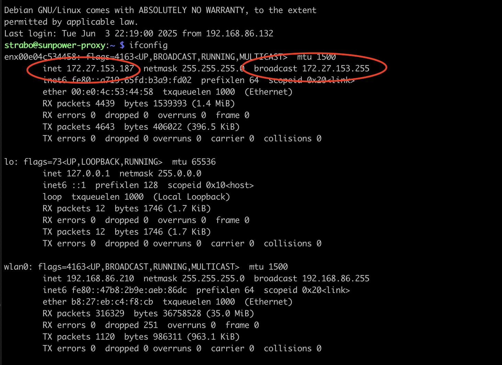
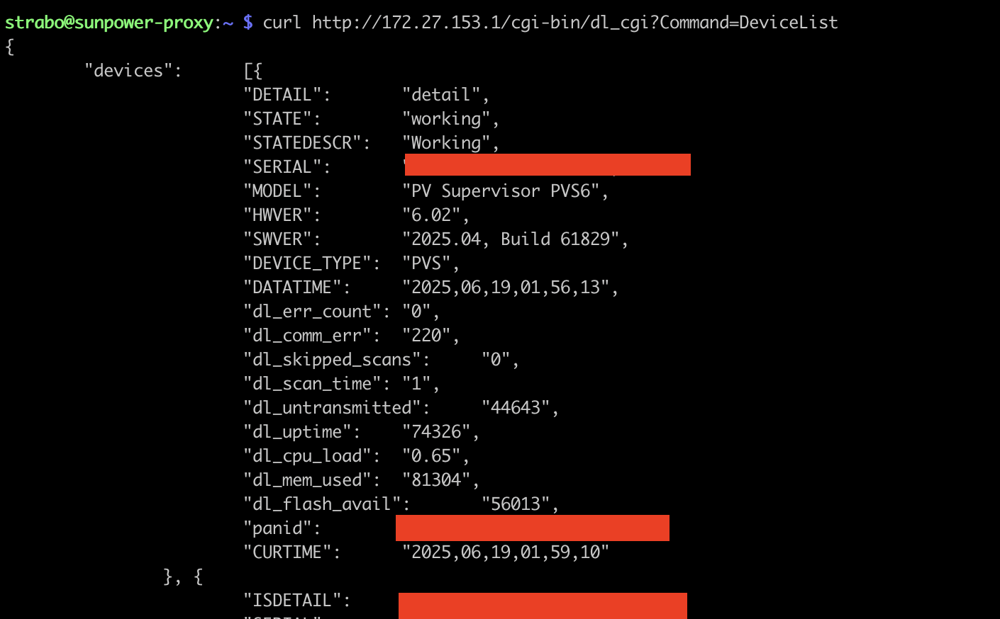
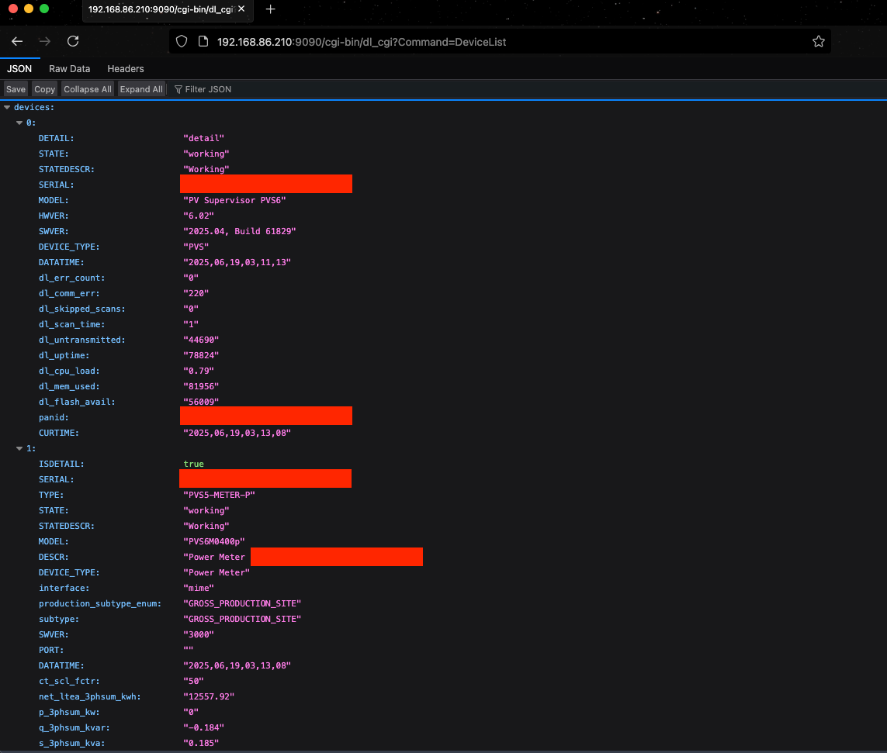
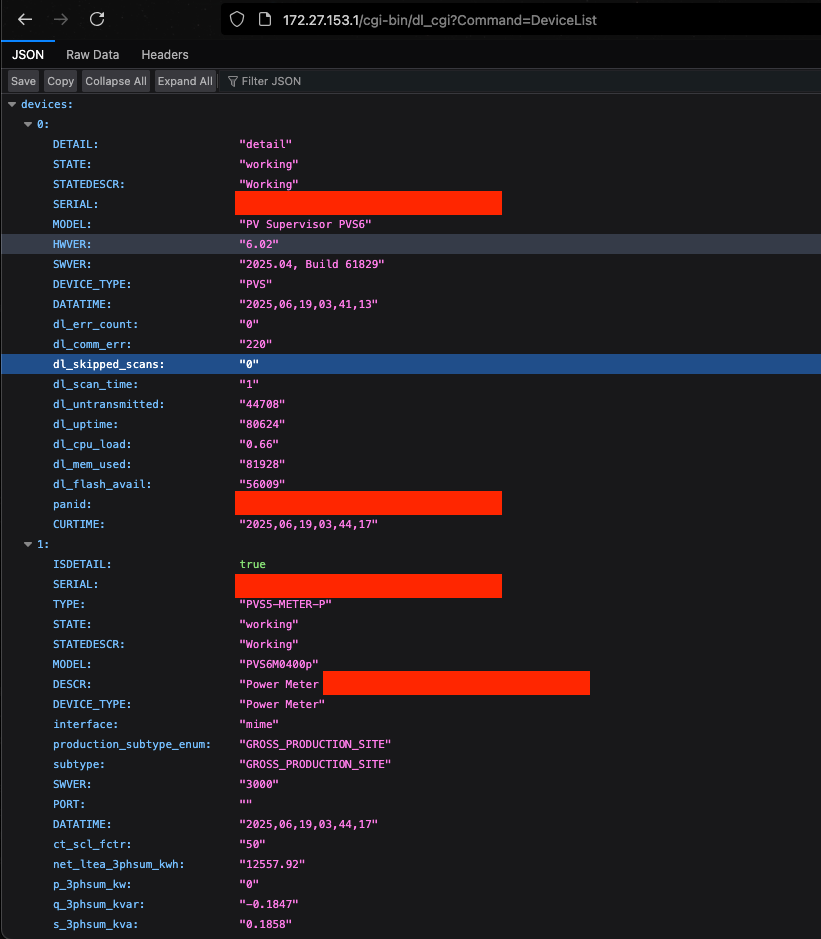

# PVS5/6 Reverse Proxy Guide
This is a guide to establish a working proxy/bridge to the PVS that you can use call its API locally.  

Having access to the API opens the door to self-monitoring for the SunPower system.

Alot of the info from this guide comes from [Dolf Starreveld's documentation](https://starreveld.com/PVS6%20Access%20and%20API.pdf) and the [PVS6 Notes](https://gist.github.com/koleson/5c719620039e0282976a8263c068e85c) written by [/u/ItsaMeKielO](https://www.reddit.com/user/ItsaMeKielO/).

Other info comes from stuff I read in the [/r/Sunpower subreddit](https://www.reddit.com/r/sunpower).

Prior to trying anything here, you will want to block the PVS from the internet on your wifi network.  This should force it over to cellular mode which, in theory, should not do a firmware update.

Note: This guide should work for firmware versions 2025.04, build 61829 and below.  

There are two ways you can establish this proxy. You can either connect a pi/device/computer directly to the PVS's LAN port or possibly directly connect to the PVS via its wifi hotspot.  Both of these methods are described further down.

I took the approach of connecting a Raspberry Pi Zero W to my PVS6's LAN port.  However, you should be able to use ANY computer with Debian OS that has wifi and an ethernet port.

Here is what my setup looks like: 
 


## Connecting a computer directly to the PVS's LAN Port

NOTE: This method should, in theory, work with any computer running Debian OS and has a wifi connection and an ethernet connection.

1. Pop open the front panel of the PVS by using a flathead screwdriver on the plastic flap under the serial number label.


2. Once you open it up, take a look at the ports.  In particular, you are looking for a port labeled "LAN".  In my PVS6, it is a USB port labelled "USB2/LAN":


3. If your LAN port is an ethernet port, you can continue to step 4.  If your LAN port is a USB port like what I have in my PVS6 pictured above, stop.  
You may need a very specific USB Ethernet dongle before continuing with this approach.
While some people have had success using a generic USB 2.0 ethernet dongle, [Dolf Starreveld's guide](https://starreveld.com/PVS6%20Access%20and%20API.pdf) specifically mentions two "approved" dongles that can be used: 
   
    * Plugable USB2-E1000
    * Cable Matters 202023 (I got this one)


4. Now that you have determined what the LAN port is, let's start by installing Raspberry Pi OS Lite on the pi.  
   1. If you are using a Debian OS computer instead of a Pi.  You can skip to step iv.
   2. There are numerous guides for this, but the easiest way is to use the [Raspberry Pi Imager from raspberrypi.com](https://www.raspberrypi.com/software/). 
   3. Install Raspberry Pi OS Lite.  Be sure to set up the image to have the ssh server and already have wifi configured to connect to your own wifi network.
   4. Make a note of the IP address that the pi is using and ensure you can SSH into it
      1. example ssh command line (should also work in windows): ssh pi@192.168.86.222
      2. Just to update the OS and install a tool we will need later to verify, run this command too:
         1. sudo apt-get update && sudo apt-get install curl && sudo apt-get upgrade -y
      

5. Once you have Raspberry Pi OS Lite installed and you can successfully connect to it, it's time to connect it to the PVS.
   1. Turn off the PVS by turning off the breaker connected to the PVS.  Ensure the light is off.
   2. Connect the raspberry pi's ethernet port to the LAN port on the PVS.
      1. Note: The LAN port might be the USB port as shown in my PVS6 picture above.
   3. Connect the raspberry pi's power to the USB4 port on the PVS.  This is to have it power on when the PVS is powered on.
   4. Turn on the PVS.  Wait for it to show the blue light and verify the pi is on.
   

6. Now that everything is on, verify that the pi has a valid connection to the PVS.
   1. SSH into the pi.  You should be at the command prompt.
   2. Since the PVS also functions as a DHCP server, we can verify easily if the pi has a valid connection by running the "ifconfig" command.
      
   3. If you see that you have an ip address in the form 172.27.153.xxx from broadcast 172.27.153.255, then the PVS DHCP server is working for you.  
      1. If not, check if you are using the "recommended" dongle if using a USB port or the right "LAN" port.
      
      
7. Now that the DHCP server is working, let's check we can hit the API!
   1. The PVS API will always be on 172.27.153.1.  So let's try to hit the famous "DeviceList" API call and see the output:
      1. curl http://172.27.153.1/cgi-bin/dl_cgi?Command=DeviceList 
         
      2. If you see output similar to the above, congrats!  You are able to hit the PVS's local API!
      3. If you do not...
         1. verify you have the right IP address in ifconfig.  
         2. You may also want to try power cycling the PVS again.  
         3. You can also check the firmware version.  I have only tested this on "2025.04, Build 61829", so it's possible it doesn't work with later versions.
         4. ???????
         
      
8. We now have a connection to the PVS and verified we can hit the API.  However, we still need a way for other devices (for example, Home Assistant) to connect to get the PVS data.
To do this, we will need to install what is called a "reverse proxy".  This will act as a bridge between your real network and the PVS.  On the home assistant guides, you will see they use haproxy.  For this guide, we will instead use Caddy, which I find to be easier to use than haproxy.
   1. Install Caddy using these instructions: https://caddyserver.com/docs/install#debian-ubuntu-raspbian
   2. Once Caddy is installed and working, add this to the /etc/caddy/Caddyfile 
      ````
      {
        auto_https off
      }
   
      :9090 {
        reverse_proxy 172.27.153.1:80
      }
      ````
   3. Now on a web browser, try to hit the proxy by going to http://[IP_ADDRESS_OF_YOUR_PI]:9090/cgi-bin/dl_cgi?Command=DeviceList
      1. You should get something that looks very familiar!
      
      
   
9. With this, you now have a reverse proxy that you can use to hit the PVS API locally!    
   1. If you have Home Assistant, you can make use of the [Home Assistant Sunpower integration](https://github.com/krbaker/hass-sunpower)
   2. If you do not want to use Home Assistant, I am currently working refactoring some of my code in the Python script that I use which I will post in the near future.
   
   
## Directly connect to the PVS via its wifi hotspot 

For the PVS, the wifi hotspot is active for at least 4 hours whenever you power cycle it.  It will also stay up indefinitely as long as you hit dl_cgi once every 30 minutes.
As a result, we can possibly take advantage of this to poll the PVS.

1. Look for a wifi point called "SunPowerXXXXX", where XXXXX will be some numbers. These numbers are actually the 5th, 6th and last 3 numbers of the PVS Serial #.
   1. For example, if your serial number is "ZT19**05**85000549A6**185**", the SSID will be "SunPower05185"
   1. If you do not see it, power cycle the PVS.  The wifi hotspot should appear a little bit after it's been turned on again.


2. Per [Dolf Starreveld's documentation](https://starreveld.com/PVS6%20Access%20and%20API.pdf), the password for this wifi point is also derived from the PVS serial number.  
   1. The password for the wifi point is the 3rd, 4th, 5th, 6th and last four characters of your serial number.
      1. For example, the password is "19056185" if the PVS serial number is ZT**1905**85000549A**6185**


3. Once you connect to the wifi point, open a web browser and attempt to go to http://172.27.153.1/cgi-bin/dl_cgi?Command=DeviceList 
   

4. From here, you can just poll the PVS for data and add whatever you want locally (like a field computer) or have a pi (or similar setup) just proxy to a wifi connection instead of a wired one like above.

5. NOTE: Based on some extra info, this hotspot should remain on as long as you hit dl_cgi **AT LEAST ONCE** every 30 minutes.  Otherwise, it will disappear again after some time.  You can always power cycle it again if you want the wifi point back for infrequent health checks.


### Improvements to the guide and my own setup
* The caddy setup I'm using is not as secure as I want.  I would much rather restrict it to GETs, use HTTPS and protect it behind some credentials. 
* Add guide to python script once I'm done with the refactor
